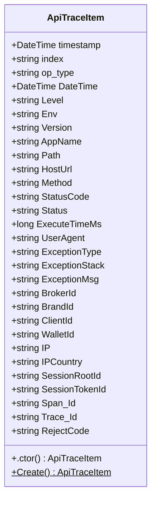
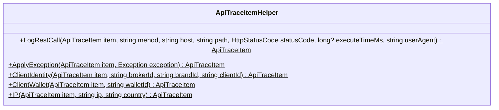
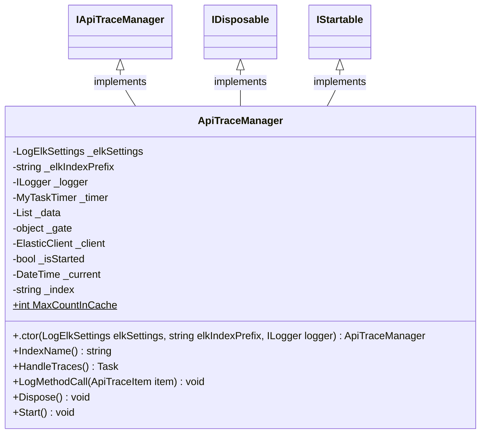
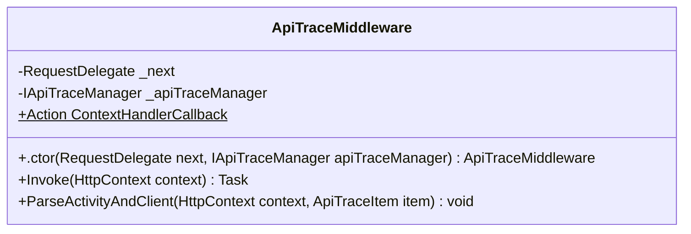
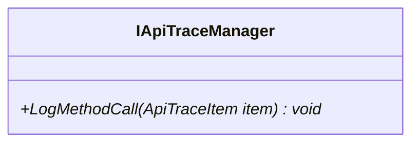
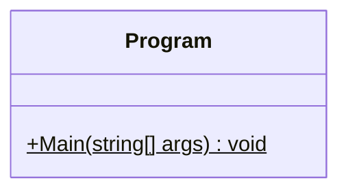

<!-- markdownlint-capture -->
<!-- markdownlint-disable -->

# Code Metrics

This file is dynamically maintained by a bot, *please do not* edit this by hand. It represents various [code metrics](https://aka.ms/dotnet/code-metrics), such as cyclomatic complexity, maintainability index, and so on.

## MyJetWallet.Sdk.RestApiTrace :radioactive:

The *MyJetWallet.Sdk.RestApiTrace.csproj* project file contains:

- 1 namespaces.
- 5 named types.
- 361 total lines of source code.
- Approximately 125 lines of executable code.
- The highest cyclomatic complexity is 10 :radioactive:.

  <strong id="myjetwallet-sdk-restapitrace">
    MyJetWallet.Sdk.RestApiTrace :radioactive:
  </strong>

 

The `MyJetWallet.Sdk.RestApiTrace` namespace contains 5 named types.

- 5 named types.
- 361 total lines of source code.
- Approximately 125 lines of executable code.
- The highest cyclomatic complexity is 10 :radioactive:.

  <strong id="apitraceitem">
    ApiTraceItem :heavy_check_mark:
  </strong>

 

- The `ApiTraceItem` contains 31 members.
- 57 total lines of source code.
- Approximately 12 lines of executable code.
- The highest cyclomatic complexity is 2 :heavy_check_mark:.

| Member kind | Line number | Maintainability index | Cyclomatic complexity | Depth of inheritance | Class coupling | Lines of source / executable code |
| :-: | :-: | :-: | :-: | :-: | :-: | :-: |
| Method | <a href='https://github.com/MyJetWallet/MyJetWallet.Sdk.RestApiTrace/blob/master/src/MyJetWallet.Sdk.RestApiTrace/ApiTraceItem.cs#L51' title='ApiTraceItem.ApiTraceItem()'>51</a> | 70 | 1 :heavy_check_mark: | 0 | 2 | 9 / 6 |
| Property | <a href='https://github.com/MyJetWallet/MyJetWallet.Sdk.RestApiTrace/blob/master/src/MyJetWallet.Sdk.RestApiTrace/ApiTraceItem.cs#L23' title='string ApiTraceItem.AppName'>23</a> | 100 | 2 :heavy_check_mark: | 0 | 0 | 1 / 0 |
| Property | <a href='https://github.com/MyJetWallet/MyJetWallet.Sdk.RestApiTrace/blob/master/src/MyJetWallet.Sdk.RestApiTrace/ApiTraceItem.cs#L36' title='string ApiTraceItem.BrandId'>36</a> | 100 | 2 :heavy_check_mark: | 0 | 0 | 1 / 0 |
| Property | <a href='https://github.com/MyJetWallet/MyJetWallet.Sdk.RestApiTrace/blob/master/src/MyJetWallet.Sdk.RestApiTrace/ApiTraceItem.cs#L35' title='string ApiTraceItem.BrokerId'>35</a> | 100 | 2 :heavy_check_mark: | 0 | 0 | 1 / 0 |
| Property | <a href='https://github.com/MyJetWallet/MyJetWallet.Sdk.RestApiTrace/blob/master/src/MyJetWallet.Sdk.RestApiTrace/ApiTraceItem.cs#L37' title='string ApiTraceItem.ClientId'>37</a> | 100 | 2 :heavy_check_mark: | 0 | 0 | 1 / 0 |
| Method | <a href='https://github.com/MyJetWallet/MyJetWallet.Sdk.RestApiTrace/blob/master/src/MyJetWallet.Sdk.RestApiTrace/ApiTraceItem.cs#L61' title='ApiTraceItem ApiTraceItem.Create()'>61</a> | 100 | 1 :heavy_check_mark: | 0 | 0 | 4 / 1 |
| Property | <a href='https://github.com/MyJetWallet/MyJetWallet.Sdk.RestApiTrace/blob/master/src/MyJetWallet.Sdk.RestApiTrace/ApiTraceItem.cs#L19' title='DateTime ApiTraceItem.DateTime'>19</a> | 100 | 2 :heavy_check_mark: | 0 | 1 | 1 / 0 |
| Property | <a href='https://github.com/MyJetWallet/MyJetWallet.Sdk.RestApiTrace/blob/master/src/MyJetWallet.Sdk.RestApiTrace/ApiTraceItem.cs#L21' title='string ApiTraceItem.Env'>21</a> | 100 | 2 :heavy_check_mark: | 0 | 0 | 1 / 0 |
| Property | <a href='https://github.com/MyJetWallet/MyJetWallet.Sdk.RestApiTrace/blob/master/src/MyJetWallet.Sdk.RestApiTrace/ApiTraceItem.cs#L34' title='string ApiTraceItem.ExceptionMsg'>34</a> | 100 | 2 :heavy_check_mark: | 0 | 0 | 1 / 0 |
| Property | <a href='https://github.com/MyJetWallet/MyJetWallet.Sdk.RestApiTrace/blob/master/src/MyJetWallet.Sdk.RestApiTrace/ApiTraceItem.cs#L33' title='string ApiTraceItem.ExceptionStack'>33</a> | 100 | 2 :heavy_check_mark: | 0 | 0 | 1 / 0 |
| Property | <a href='https://github.com/MyJetWallet/MyJetWallet.Sdk.RestApiTrace/blob/master/src/MyJetWallet.Sdk.RestApiTrace/ApiTraceItem.cs#L32' title='string ApiTraceItem.ExceptionType'>32</a> | 100 | 2 :heavy_check_mark: | 0 | 0 | 1 / 0 |
| Property | <a href='https://github.com/MyJetWallet/MyJetWallet.Sdk.RestApiTrace/blob/master/src/MyJetWallet.Sdk.RestApiTrace/ApiTraceItem.cs#L29' title='long ApiTraceItem.ExecuteTimeMs'>29</a> | 100 | 2 :heavy_check_mark: | 0 | 0 | 1 / 0 |
| Property | <a href='https://github.com/MyJetWallet/MyJetWallet.Sdk.RestApiTrace/blob/master/src/MyJetWallet.Sdk.RestApiTrace/ApiTraceItem.cs#L25' title='string ApiTraceItem.HostUrl'>25</a> | 100 | 2 :heavy_check_mark: | 0 | 0 | 1 / 0 |
| Property | <a href='https://github.com/MyJetWallet/MyJetWallet.Sdk.RestApiTrace/blob/master/src/MyJetWallet.Sdk.RestApiTrace/ApiTraceItem.cs#L15' title='string ApiTraceItem.index'>15</a> | 100 | 2 :heavy_check_mark: | 0 | 0 | 1 / 0 |
| Property | <a href='https://github.com/MyJetWallet/MyJetWallet.Sdk.RestApiTrace/blob/master/src/MyJetWallet.Sdk.RestApiTrace/ApiTraceItem.cs#L39' title='string ApiTraceItem.IP'>39</a> | 100 | 2 :heavy_check_mark: | 0 | 0 | 1 / 0 |
| Property | <a href='https://github.com/MyJetWallet/MyJetWallet.Sdk.RestApiTrace/blob/master/src/MyJetWallet.Sdk.RestApiTrace/ApiTraceItem.cs#L40' title='string ApiTraceItem.IPCountry'>40</a> | 100 | 2 :heavy_check_mark: | 0 | 0 | 1 / 0 |
| Property | <a href='https://github.com/MyJetWallet/MyJetWallet.Sdk.RestApiTrace/blob/master/src/MyJetWallet.Sdk.RestApiTrace/ApiTraceItem.cs#L20' title='string ApiTraceItem.Level'>20</a> | 100 | 2 :heavy_check_mark: | 0 | 0 | 1 / 0 |
| Property | <a href='https://github.com/MyJetWallet/MyJetWallet.Sdk.RestApiTrace/blob/master/src/MyJetWallet.Sdk.RestApiTrace/ApiTraceItem.cs#L26' title='string ApiTraceItem.Method'>26</a> | 100 | 2 :heavy_check_mark: | 0 | 0 | 1 / 0 |
| Property | <a href='https://github.com/MyJetWallet/MyJetWallet.Sdk.RestApiTrace/blob/master/src/MyJetWallet.Sdk.RestApiTrace/ApiTraceItem.cs#L17' title='string ApiTraceItem.op_type'>17</a> | 100 | 2 :heavy_check_mark: | 0 | 0 | 1 / 1 |
| Property | <a href='https://github.com/MyJetWallet/MyJetWallet.Sdk.RestApiTrace/blob/master/src/MyJetWallet.Sdk.RestApiTrace/ApiTraceItem.cs#L24' title='string ApiTraceItem.Path'>24</a> | 100 | 2 :heavy_check_mark: | 0 | 0 | 1 / 0 |
| Property | <a href='https://github.com/MyJetWallet/MyJetWallet.Sdk.RestApiTrace/blob/master/src/MyJetWallet.Sdk.RestApiTrace/ApiTraceItem.cs#L48' title='string ApiTraceItem.RejectCode'>48</a> | 100 | 2 :heavy_check_mark: | 0 | 0 | 1 / 0 |
| Property | <a href='https://github.com/MyJetWallet/MyJetWallet.Sdk.RestApiTrace/blob/master/src/MyJetWallet.Sdk.RestApiTrace/ApiTraceItem.cs#L43' title='string ApiTraceItem.SessionRootId'>43</a> | 100 | 2 :heavy_check_mark: | 0 | 0 | 1 / 0 |
| Property | <a href='https://github.com/MyJetWallet/MyJetWallet.Sdk.RestApiTrace/blob/master/src/MyJetWallet.Sdk.RestApiTrace/ApiTraceItem.cs#L44' title='string ApiTraceItem.SessionTokenId'>44</a> | 100 | 2 :heavy_check_mark: | 0 | 0 | 1 / 0 |
| Property | <a href='https://github.com/MyJetWallet/MyJetWallet.Sdk.RestApiTrace/blob/master/src/MyJetWallet.Sdk.RestApiTrace/ApiTraceItem.cs#L45' title='string ApiTraceItem.Span_Id'>45</a> | 100 | 2 :heavy_check_mark: | 0 | 0 | 1 / 0 |
| Property | <a href='https://github.com/MyJetWallet/MyJetWallet.Sdk.RestApiTrace/blob/master/src/MyJetWallet.Sdk.RestApiTrace/ApiTraceItem.cs#L28' title='string ApiTraceItem.Status'>28</a> | 100 | 2 :heavy_check_mark: | 0 | 0 | 1 / 0 |
| Property | <a href='https://github.com/MyJetWallet/MyJetWallet.Sdk.RestApiTrace/blob/master/src/MyJetWallet.Sdk.RestApiTrace/ApiTraceItem.cs#L27' title='string ApiTraceItem.StatusCode'>27</a> | 100 | 2 :heavy_check_mark: | 0 | 0 | 1 / 0 |
| Property | <a href='https://github.com/MyJetWallet/MyJetWallet.Sdk.RestApiTrace/blob/master/src/MyJetWallet.Sdk.RestApiTrace/ApiTraceItem.cs#L13' title='DateTime ApiTraceItem.timestamp'>13</a> | 100 | 2 :heavy_check_mark: | 0 | 3 | 3 / 4 |
| Property | <a href='https://github.com/MyJetWallet/MyJetWallet.Sdk.RestApiTrace/blob/master/src/MyJetWallet.Sdk.RestApiTrace/ApiTraceItem.cs#L46' title='string ApiTraceItem.Trace_Id'>46</a> | 100 | 2 :heavy_check_mark: | 0 | 0 | 1 / 0 |
| Property | <a href='https://github.com/MyJetWallet/MyJetWallet.Sdk.RestApiTrace/blob/master/src/MyJetWallet.Sdk.RestApiTrace/ApiTraceItem.cs#L30' title='string ApiTraceItem.UserAgent'>30</a> | 100 | 2 :heavy_check_mark: | 0 | 0 | 1 / 0 |
| Property | <a href='https://github.com/MyJetWallet/MyJetWallet.Sdk.RestApiTrace/blob/master/src/MyJetWallet.Sdk.RestApiTrace/ApiTraceItem.cs#L22' title='string ApiTraceItem.Version'>22</a> | 100 | 2 :heavy_check_mark: | 0 | 0 | 1 / 0 |
| Property | <a href='https://github.com/MyJetWallet/MyJetWallet.Sdk.RestApiTrace/blob/master/src/MyJetWallet.Sdk.RestApiTrace/ApiTraceItem.cs#L38' title='string ApiTraceItem.WalletId'>38</a> | 100 | 2 :heavy_check_mark: | 0 | 0 | 1 / 0 |

<a href="#ApiTraceItem-class-diagram">:link: to `ApiTraceItem` class diagram</a>

<a href="#myjetwallet-sdk-restapitrace">:top: back to MyJetWallet.Sdk.RestApiTrace</a>

  <strong id="apitraceitemhelper">
    ApiTraceItemHelper :heavy_check_mark:
  </strong>

 

- The `ApiTraceItemHelper` contains 5 members.
- 49 total lines of source code.
- Approximately 22 lines of executable code.
- The highest cyclomatic complexity is 4 :heavy_check_mark:.

| Member kind | Line number | Maintainability index | Cyclomatic complexity | Depth of inheritance | Class coupling | Lines of source / executable code |
| :-: | :-: | :-: | :-: | :-: | :-: | :-: |
| Method | <a href='https://github.com/MyJetWallet/MyJetWallet.Sdk.RestApiTrace/blob/master/src/MyJetWallet.Sdk.RestApiTrace/ApiTraceItemHelper.cs#L21' title='ApiTraceItem ApiTraceItemHelper.ApplyException(ApiTraceItem item, Exception exception)'>21</a> | 72 | 2 :heavy_check_mark: | 0 | 3 | 10 / 5 |
| Method | <a href='https://github.com/MyJetWallet/MyJetWallet.Sdk.RestApiTrace/blob/master/src/MyJetWallet.Sdk.RestApiTrace/ApiTraceItemHelper.cs#L32' title='ApiTraceItem ApiTraceItemHelper.ClientIdentity(ApiTraceItem item, string brokerId, string brandId, string clientId)'>32</a> | 74 | 4 :heavy_check_mark: | 0 | 2 | 8 / 4 |
| Method | <a href='https://github.com/MyJetWallet/MyJetWallet.Sdk.RestApiTrace/blob/master/src/MyJetWallet.Sdk.RestApiTrace/ApiTraceItemHelper.cs#L41' title='ApiTraceItem ApiTraceItemHelper.ClientWallet(ApiTraceItem item, string walletId)'>41</a> | 85 | 2 :heavy_check_mark: | 0 | 2 | 6 / 2 |
| Method | <a href='https://github.com/MyJetWallet/MyJetWallet.Sdk.RestApiTrace/blob/master/src/MyJetWallet.Sdk.RestApiTrace/ApiTraceItemHelper.cs#L48' title='ApiTraceItem ApiTraceItemHelper.IP(ApiTraceItem item, string ip, string country)'>48</a> | 79 | 1 :heavy_check_mark: | 0 | 1 | 6 / 3 |
| Method | <a href='https://github.com/MyJetWallet/MyJetWallet.Sdk.RestApiTrace/blob/master/src/MyJetWallet.Sdk.RestApiTrace/ApiTraceItemHelper.cs#L8' title='ApiTraceItem ApiTraceItemHelper.LogRestCall(ApiTraceItem item, string mehod, string host, string path, HttpStatusCode statusCode, long? executeTimeMs, string userAgent)'>8</a> | 65 | 2 :heavy_check_mark: | 0 | 4 | 12 / 8 |

<a href="#ApiTraceItemHelper-class-diagram">:link: to `ApiTraceItemHelper` class diagram</a>

<a href="#myjetwallet-sdk-restapitrace">:top: back to MyJetWallet.Sdk.RestApiTrace</a>

  <strong id="apitracemanager">
    ApiTraceManager :heavy_check_mark:
  </strong>

 

- The `ApiTraceManager` contains 17 members.
- 133 total lines of source code.
- Approximately 47 lines of executable code.
- The highest cyclomatic complexity is 7 :heavy_check_mark:.

| Member kind | Line number | Maintainability index | Cyclomatic complexity | Depth of inheritance | Class coupling | Lines of source / executable code |
| :-: | :-: | :-: | :-: | :-: | :-: | :-: |
| Field | <a href='https://github.com/MyJetWallet/MyJetWallet.Sdk.RestApiTrace/blob/master/src/MyJetWallet.Sdk.RestApiTrace/ApiTraceManager.cs#L26' title='ElasticClient ApiTraceManager._client'>26</a> | 100 | 0 :heavy_check_mark: | 0 | 1 | 1 / 0 |
| Field | <a href='https://github.com/MyJetWallet/MyJetWallet.Sdk.RestApiTrace/blob/master/src/MyJetWallet.Sdk.RestApiTrace/ApiTraceManager.cs#L41' title='DateTime ApiTraceManager._current'>41</a> | 93 | 0 :heavy_check_mark: | 0 | 2 | 1 / 1 |
| Field | <a href='https://github.com/MyJetWallet/MyJetWallet.Sdk.RestApiTrace/blob/master/src/MyJetWallet.Sdk.RestApiTrace/ApiTraceManager.cs#L24' title='List<ApiTraceItem> ApiTraceManager._data'>24</a> | 93 | 0 :heavy_check_mark: | 0 | 2 | 1 / 1 |
| Field | <a href='https://github.com/MyJetWallet/MyJetWallet.Sdk.RestApiTrace/blob/master/src/MyJetWallet.Sdk.RestApiTrace/ApiTraceManager.cs#L20' title='string ApiTraceManager._elkIndexPrefix'>20</a> | 100 | 0 :heavy_check_mark: | 0 | 0 | 1 / 0 |
| Field | <a href='https://github.com/MyJetWallet/MyJetWallet.Sdk.RestApiTrace/blob/master/src/MyJetWallet.Sdk.RestApiTrace/ApiTraceManager.cs#L19' title='LogElkSettings ApiTraceManager._elkSettings'>19</a> | 100 | 0 :heavy_check_mark: | 0 | 1 | 1 / 0 |
| Field | <a href='https://github.com/MyJetWallet/MyJetWallet.Sdk.RestApiTrace/blob/master/src/MyJetWallet.Sdk.RestApiTrace/ApiTraceManager.cs#L25' title='object ApiTraceManager._gate'>25</a> | 93 | 0 :heavy_check_mark: | 0 | 0 | 1 / 1 |
| Field | <a href='https://github.com/MyJetWallet/MyJetWallet.Sdk.RestApiTrace/blob/master/src/MyJetWallet.Sdk.RestApiTrace/ApiTraceManager.cs#L42' title='string ApiTraceManager._index'>42</a> | 93 | 0 :heavy_check_mark: | 0 | 0 | 1 / 1 |
| Field | <a href='https://github.com/MyJetWallet/MyJetWallet.Sdk.RestApiTrace/blob/master/src/MyJetWallet.Sdk.RestApiTrace/ApiTraceManager.cs#L28' title='bool ApiTraceManager._isStarted'>28</a> | 93 | 0 :heavy_check_mark: | 0 | 0 | 1 / 1 |
| Field | <a href='https://github.com/MyJetWallet/MyJetWallet.Sdk.RestApiTrace/blob/master/src/MyJetWallet.Sdk.RestApiTrace/ApiTraceManager.cs#L21' title='ILogger ApiTraceManager._logger'>21</a> | 100 | 0 :heavy_check_mark: | 0 | 1 | 1 / 0 |
| Field | <a href='https://github.com/MyJetWallet/MyJetWallet.Sdk.RestApiTrace/blob/master/src/MyJetWallet.Sdk.RestApiTrace/ApiTraceManager.cs#L22' title='MyTaskTimer ApiTraceManager._timer'>22</a> | 100 | 0 :heavy_check_mark: | 0 | 1 | 1 / 0 |
| Method | <a href='https://github.com/MyJetWallet/MyJetWallet.Sdk.RestApiTrace/blob/master/src/MyJetWallet.Sdk.RestApiTrace/ApiTraceManager.cs#L30' title='ApiTraceManager.ApiTraceManager(LogElkSettings elkSettings, string elkIndexPrefix, ILogger logger)'>30</a> | 74 | 1 :heavy_check_mark: | 0 | 4 | 10 / 4 |
| Method | <a href='https://github.com/MyJetWallet/MyJetWallet.Sdk.RestApiTrace/blob/master/src/MyJetWallet.Sdk.RestApiTrace/ApiTraceManager.cs#L126' title='void ApiTraceManager.Dispose()'>126</a> | 93 | 1 :heavy_check_mark: | 0 | 2 | 5 / 2 |
| Method | <a href='https://github.com/MyJetWallet/MyJetWallet.Sdk.RestApiTrace/blob/master/src/MyJetWallet.Sdk.RestApiTrace/ApiTraceManager.cs#L54' title='Task ApiTraceManager.HandleTraces()'>54</a> | 51 | 7 :heavy_check_mark: | 0 | 11 | 60 / 25 |
| Method | <a href='https://github.com/MyJetWallet/MyJetWallet.Sdk.RestApiTrace/blob/master/src/MyJetWallet.Sdk.RestApiTrace/ApiTraceManager.cs#L44' title='string ApiTraceManager.IndexName()'>44</a> | 75 | 2 :heavy_check_mark: | 0 | 2 | 9 / 4 |
| Method | <a href='https://github.com/MyJetWallet/MyJetWallet.Sdk.RestApiTrace/blob/master/src/MyJetWallet.Sdk.RestApiTrace/ApiTraceManager.cs#L115' title='void ApiTraceManager.LogMethodCall(ApiTraceItem item)'>115</a> | 78 | 3 :heavy_check_mark: | 0 | 3 | 10 / 3 |
| Property | <a href='https://github.com/MyJetWallet/MyJetWallet.Sdk.RestApiTrace/blob/master/src/MyJetWallet.Sdk.RestApiTrace/ApiTraceManager.cs#L17' title='int ApiTraceManager.MaxCountInCache'>17</a> | 100 | 2 :heavy_check_mark: | 0 | 0 | 1 / 1 |
| Method | <a href='https://github.com/MyJetWallet/MyJetWallet.Sdk.RestApiTrace/blob/master/src/MyJetWallet.Sdk.RestApiTrace/ApiTraceManager.cs#L132' title='void ApiTraceManager.Start()'>132</a> | 70 | 4 :heavy_check_mark: | 0 | 4 | 15 / 6 |

<a href="#ApiTraceManager-class-diagram">:link: to `ApiTraceManager` class diagram</a>

<a href="#myjetwallet-sdk-restapitrace">:top: back to MyJetWallet.Sdk.RestApiTrace</a>

  <strong id="apitracemiddleware">
    ApiTraceMiddleware :radioactive:
  </strong>

 

- The `ApiTraceMiddleware` contains 6 members.
- 104 total lines of source code.
- Approximately 44 lines of executable code.
- The highest cyclomatic complexity is 10 :radioactive:.

| Member kind | Line number | Maintainability index | Cyclomatic complexity | Depth of inheritance | Class coupling | Lines of source / executable code |
| :-: | :-: | :-: | :-: | :-: | :-: | :-: |
| Field | <a href='https://github.com/MyJetWallet/MyJetWallet.Sdk.RestApiTrace/blob/master/src/MyJetWallet.Sdk.RestApiTrace/ApiTraceMiddleware.cs#L21' title='IApiTraceManager ApiTraceMiddleware._apiTraceManager'>21</a> | 100 | 0 :heavy_check_mark: | 0 | 1 | 1 / 0 |
| Field | <a href='https://github.com/MyJetWallet/MyJetWallet.Sdk.RestApiTrace/blob/master/src/MyJetWallet.Sdk.RestApiTrace/ApiTraceMiddleware.cs#L20' title='RequestDelegate ApiTraceMiddleware._next'>20</a> | 100 | 0 :heavy_check_mark: | 0 | 1 | 1 / 0 |
| Method | <a href='https://github.com/MyJetWallet/MyJetWallet.Sdk.RestApiTrace/blob/master/src/MyJetWallet.Sdk.RestApiTrace/ApiTraceMiddleware.cs#L23' title='ApiTraceMiddleware.ApiTraceMiddleware(RequestDelegate next, IApiTraceManager apiTraceManager)'>23</a> | 85 | 1 :heavy_check_mark: | 0 | 2 | 5 / 2 |
| Property | <a href='https://github.com/MyJetWallet/MyJetWallet.Sdk.RestApiTrace/blob/master/src/MyJetWallet.Sdk.RestApiTrace/ApiTraceMiddleware.cs#L18' title='Action<HttpContext, ApiTraceItem> ApiTraceMiddleware.ContextHandlerCallback'>18</a> | 100 | 2 :heavy_check_mark: | 0 | 3 | 1 / 0 |
| Method | <a href='https://github.com/MyJetWallet/MyJetWallet.Sdk.RestApiTrace/blob/master/src/MyJetWallet.Sdk.RestApiTrace/ApiTraceMiddleware.cs#L29' title='Task ApiTraceMiddleware.Invoke(HttpContext context)'>29</a> | 52 | 10 :radioactive: | 0 | 12 | 64 / 20 |
| Method | <a href='https://github.com/MyJetWallet/MyJetWallet.Sdk.RestApiTrace/blob/master/src/MyJetWallet.Sdk.RestApiTrace/ApiTraceMiddleware.cs#L94' title='void ApiTraceMiddleware.ParseActivityAndClient(HttpContext context, ApiTraceItem item)'>94</a> | 51 | 10 :radioactive: | 0 | 5 | 25 / 22 |

<a href="#ApiTraceMiddleware-class-diagram">:link: to `ApiTraceMiddleware` class diagram</a>

<a href="#myjetwallet-sdk-restapitrace">:top: back to MyJetWallet.Sdk.RestApiTrace</a>

  <strong id="iapitracemanager">
    IApiTraceManager :heavy_check_mark:
  </strong>

 

- The `IApiTraceManager` contains 1 members.
- 4 total lines of source code.
- Approximately 0 lines of executable code.
- The highest cyclomatic complexity is 1 :heavy_check_mark:.

| Member kind | Line number | Maintainability index | Cyclomatic complexity | Depth of inheritance | Class coupling | Lines of source / executable code |
| :-: | :-: | :-: | :-: | :-: | :-: | :-: |
| Method | <a href='https://github.com/MyJetWallet/MyJetWallet.Sdk.RestApiTrace/blob/master/src/MyJetWallet.Sdk.RestApiTrace/IApiTraceManager.cs#L5' title='void IApiTraceManager.LogMethodCall(ApiTraceItem item)'>5</a> | 100 | 1 :heavy_check_mark: | 0 | 1 | 1 / 0 |

<a href="#IApiTraceManager-class-diagram">:link: to `IApiTraceManager` class diagram</a>

<a href="#myjetwallet-sdk-restapitrace">:top: back to MyJetWallet.Sdk.RestApiTrace</a>

<a href="#myjetwallet-sdk-restapitrace">:top: back to MyJetWallet.Sdk.RestApiTrace</a>

## TestApp :heavy_check_mark:

The *TestApp.csproj* project file contains:

- 1 namespaces.
- 1 named types.
- 50 total lines of source code.
- Approximately 21 lines of executable code.
- The highest cyclomatic complexity is 1 :heavy_check_mark:.

  <strong id="testapp">
    TestApp :heavy_check_mark:
  </strong>

 

The `TestApp` namespace contains 1 named types.

- 1 named types.
- 50 total lines of source code.
- Approximately 21 lines of executable code.
- The highest cyclomatic complexity is 1 :heavy_check_mark:.

  <strong id="program">
    Program :heavy_check_mark:
  </strong>

 

- The `Program` contains 1 members.
- 47 total lines of source code.
- Approximately 21 lines of executable code.
- The highest cyclomatic complexity is 1 :heavy_check_mark:.

| Member kind | Line number | Maintainability index | Cyclomatic complexity | Depth of inheritance | Class coupling | Lines of source / executable code |
| :-: | :-: | :-: | :-: | :-: | :-: | :-: |
| Method | <a href='https://github.com/MyJetWallet/MyJetWallet.Sdk.RestApiTrace/blob/master/src/TestApp/Program.cs#L15' title='void Program.Main(string[] args)'>15</a> | 54 | 1 :heavy_check_mark: | 0 | 6 | 41 / 21 |

<a href="#Program-class-diagram">:link: to `Program` class diagram</a>

<a href="#testapp">:top: back to TestApp</a>

<a href="#testapp">:top: back to TestApp</a>

## Metric definitions

  - **Maintainability index**: Measures ease of code maintenance. Higher values are better.
  - **Cyclomatic complexity**: Measures the number of branches. Lower values are better.
  - **Depth of inheritance**: Measures length of object inheritance hierarchy. Lower values are better.
  - **Class coupling**: Measures the number of classes that are referenced. Lower values are better.
  - **Lines of source code**: Exact number of lines of source code. Lower values are better.
  - **Lines of executable code**: Approximates the lines of executable code. Lower values are better.

## Mermaid class diagrams

##### `ApiTraceItem` class diagram

##### `ApiTraceItemHelper` class diagram

##### `ApiTraceManager` class diagram

##### `ApiTraceMiddleware` class diagram

##### `IApiTraceManager` class diagram

##### `Program` class diagram

*This file is maintained by a bot.*

<!-- markdownlint-restore -->
